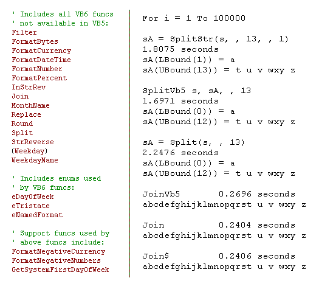



## A Complete set of VB6 functions not available in VB5

### Description

Demonstrates how simple functions written in pure VB can be faster than many of VB's built in functions. For example, the super short and simple Split function is 30% faster than VB's. The Replace function with no API optimizations is 2 times faster than VB's, and over 3 times faster on large strings ... All functions are written in pure VB. Also declares the GetLocaleInfo API for use with the First Day Of The Week related functions, and for default system settings for the Formatting functions ... This would be a great learning tool for newbies. Of course, it would also be a great resourse for anyone using VB5, just plug this module into any project to enable all the VB6 functions it uses.
 
### More Info
 

             |
---                |---
**Submitted On**   |2009-12-17 03:20:02
**By**             |[Rde](https://github.com/Planet-Source-Code/PSCIndex/blob/master/ByAuthor/rde.md)
**Level**          |Intermediate
**User Rating**    |5.0 (45 globes from 9 users)
**Compatibility**  |VB 4\.0 \(32\-bit\), VB 5\.0, VB 6\.0
**Category**       |[String Manipulation](https://github.com/Planet-Source-Code/PSCIndex/blob/master/ByCategory/string-manipulation__1-5.md)
**World**          |[Visual Basic](https://github.com/Planet-Source-Code/PSCIndex/blob/master/ByWorld/visual-basic.md)
**Archive File**   |[A\_Complete21705412172009\.zip](https://github.com/Planet-Source-Code/rde-a-complete-set-of-vb6-functions-not-available-in-vb5__1-71812/archive/master.zip)

